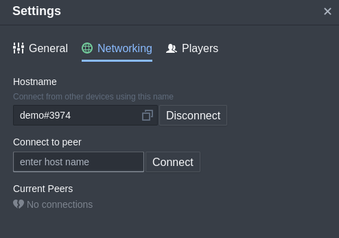
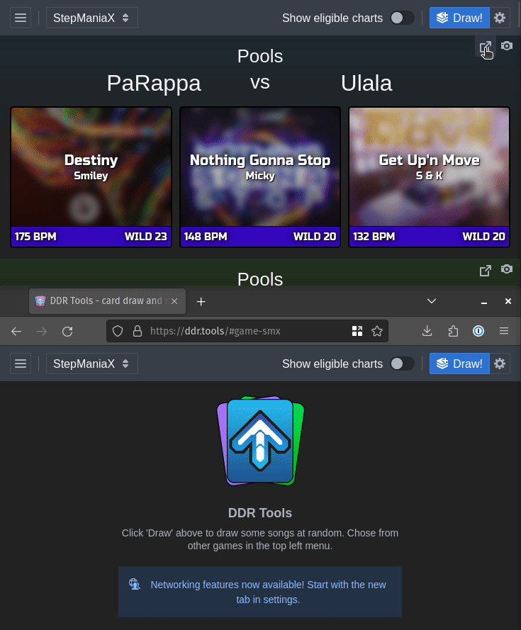
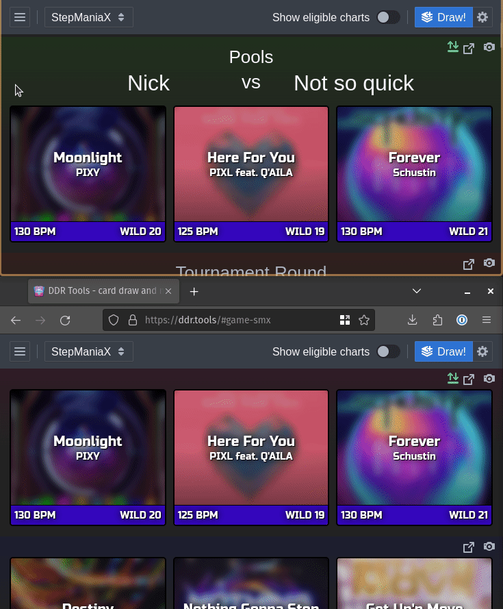

# DDR Tools Network Features

The DDR Tools app can connect with other devices over the internet to share card draw results. This can be especially useful for larger events, sharing drawn cards with an audience of spectators, etc.

## Connecting

The first step to using the network features is choosing a hostname for each device involved. After you confirm your choice, another 4 random digits will be appened to form a "Discord-like" fully unique name.

Once a hostname is chosen, that device can connect to one or more other devices (peers) by entering a valid full hostname, additional 4 digits included. While connected to at least one other peer, an addtional two actions will become available on each drawn set of cards.

## Network Actions

### Send Drawn Set

The "Send" action takes a snapshot of the current set and sends it to another device. Later actions taken on cards in that set will not appear on the remote device.

If the same set is received from a peer multiple times, the old copy will be updated and bumpped to the top of the list of sets.

### Sync Drawn Set

"Sync" is the same as "Send" execpt any further actions taken on cards in the set will also trigger another send action to the same peer. All changes to the cards made on either device will appear on the other in real-time.

Unlike repeated send actions, each update received to a sync'd set will not cause it to be moved to the top of the list of drawn sets.

## Use Cases

The network features are intentionally

- Card draw on stream: load as OBS layer, most UI goes transparent
- Separate device for commentary to see card draw from
- Perform card draws in advance, and hold in queue

## Known Issues

### Disconnects

Any device that goes to sleep or is subject to unreliable network connectivity will likely loose connection to all peers and have its hostname reservation revoked. The process of reconnecting with other devices is unfortunately painful due to the fact that:

- your chosen hostname remains reserved for some time after loosing connection and it isn't possible to reclaim it, so you're forced to have a new 4 random digits added each time.
- the networking is truly peer-to-peer, so connections have to be re-established with each peer individually

If you use these features in a tournament setting, try to mitigate this as best you can by making sure all devices used for networked card draw:

- are set to never go to sleep, nobody closes any laptop lid, or presses the lock button on any iPad
- are on a _reliable_ internet connection

Most of the above is unavoidable with the current networking design, but in the future the app may be able to remember peer hostnames to allow for more covenient reconnects.

### Missed updates

Sometimes messages between devices get lost in the big series of tubes we call the internet. The peer-to-peer networking used is inherently lossy, and this is also unavoidable with the current design.
