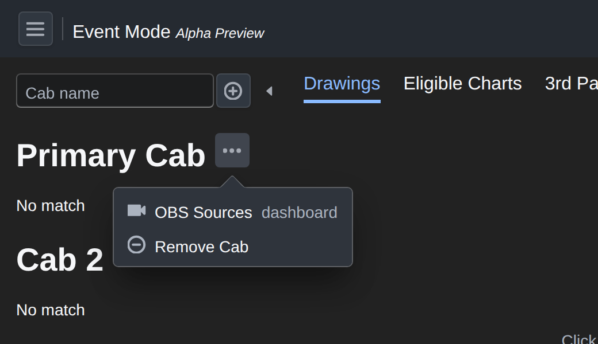
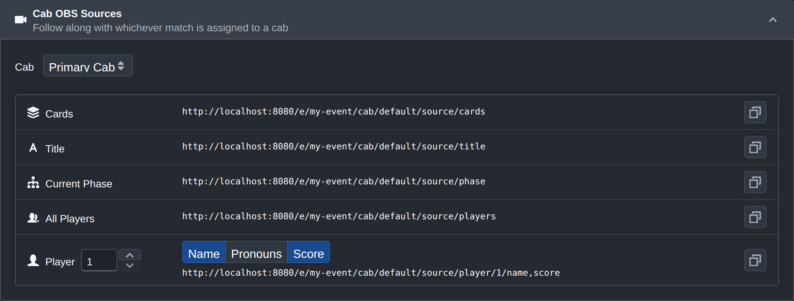
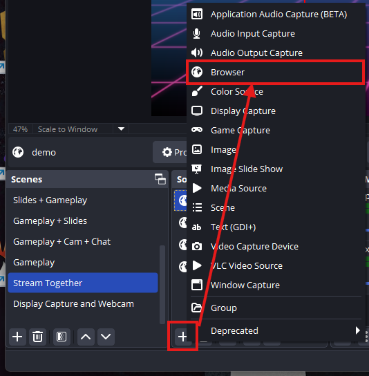
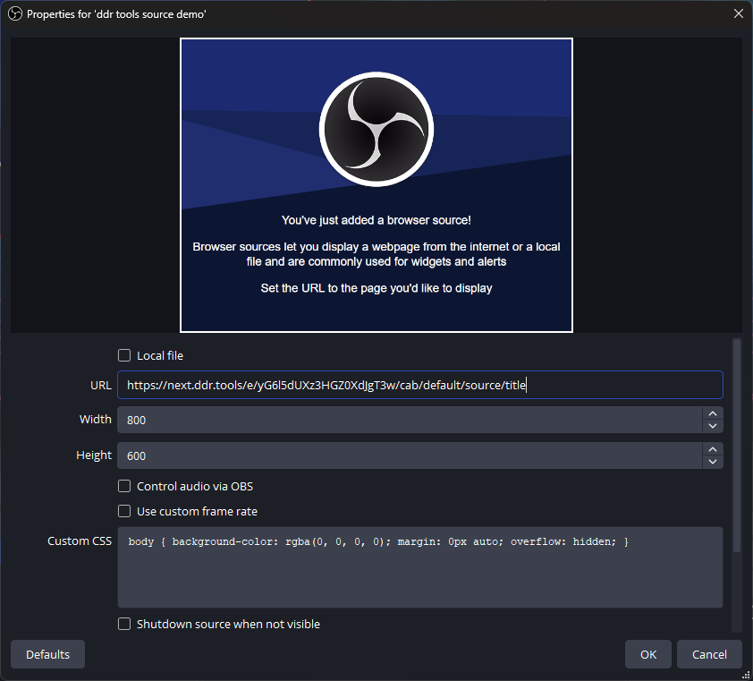
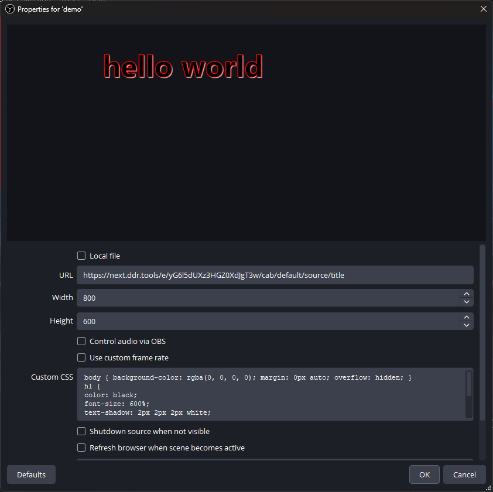
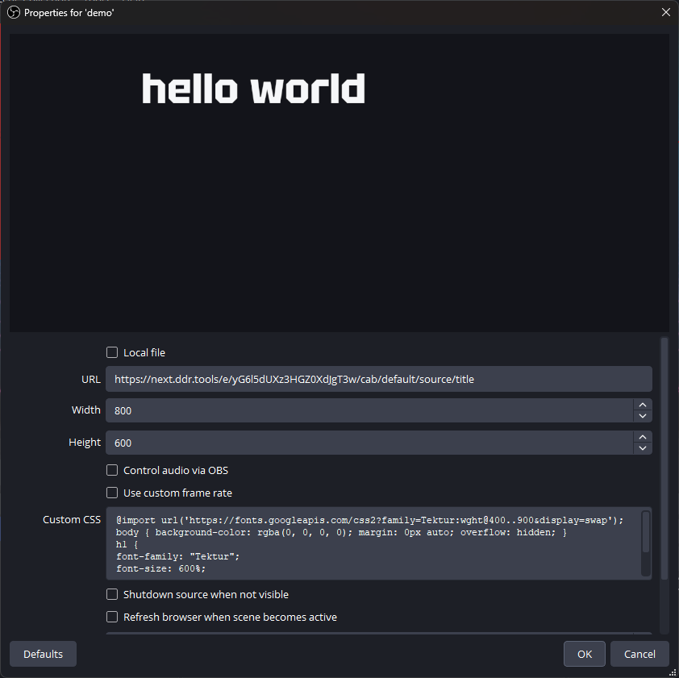

# OBS Sources

The app provides a number of single-purpose URLs for use within OBS as browser type source. Each individual cab has its own set of sources, which will update as the match assigned to that cab changes. A few sources cover the whole event rather than one cab — see [drawn chart sources](#drawn-chart-sources) below.

They all live on the stream dashboard, which you can reach from the hamburger menu or from any cab's menu in the sidebar.



Expand the "Cab OBS Sources" section, pick which cab you're setting up, and click the copy button on any row to put that URL on your clipboard.



The **Player** row builds one source out of whichever pieces of a player's info you want together. Set the player number, then toggle the parts to include — the URL updates as you go, and one source can carry any mix of them. The first part shows on its own and the rest follow in parentheses, so name and score reads `Alice (3)` while name and pronouns reads `Alice (she/her)`. Copy it, change the toggles, and copy again for a second source.

In OBS you can add the copied URL to your stream layout by adding a new browser source.



Paste the copied URL into the properties and click OK.



If you have a match assigned to the chosen cab, then you should see the text appear immediately. If nothing is assigned to the cab, then the source will display nothing at all.

Pronouns come from whatever a player has published on their start.gg profile, so they only fill in for matches drawn from start.gg, and only for players who have set them. A part with nothing behind it is left out entirely rather than showing empty parentheses, so a player with no pronouns still reads `Alice (3)`.

Inside OBS, sources always render in dark mode, so text is white by default. If you want dark text instead, set a `color` rule in your custom CSS as described below.

## Drawn chart sources

These show every chart the event has already drawn, so viewers can see what has come out of the pool. They belong to the event rather than to a cab, so they live in their own "Drawn Chart Sources" section on the dashboard and keep working no matter which match is up.

Two layouts are offered, and which one to use is a question of how much room your layout has:

- **Grid** gives each chart a small jacket, its name and its level. Easier to recognize at a glance.
- **List** drops the art for text rows grouped by level, and fits several times as many charts in the same space.

A long event spends hundreds of charts, most of them at levels the bracket has already climbed past, so the list is filtered to a level range. By default that range comes from the config behind the **most recent draw**, which keeps the source current on its own as rounds get harder — no editing mid-stream. Where that isn't what you want, say so in the URL:

- `?config=<config id>` pins the range to one config, whatever gets drawn next
- `?min=15&max=17` states a range outright; either end can be left off, so `?max=14` reads as "14 and below"
- `?all` turns filtering off and shows the event's whole history

Both halves of a pocket pick appear here, since replacing a chart spends both it and the one it replaced.

## Custom styles

Adding custom CSS to text-based sources is a great way to help the info fit the graphic design of the rest of your stream graphics.

All text-based sources from DDR Tools render inside a single `h1` HTML tag. Keep the existing default styles for `body` and add extra styles below. As a simple example:

```css
body {
  background-color: rgba(0, 0, 0, 0);
  margin: 0px auto;
  overflow: hidden;
}
h1 {
  color: black;
  font-size: 600%;
  text-shadow: 2px 2px 2px white;
  -webkit-text-stroke: 2px red;
}
```



For more info on styling text with CSS, refer to [MDN documentation](https://developer.mozilla.org/en-US/docs/Learn_web_development/Core/Text_styling).

The drawn chart sources are the exception to the single `h1`: they render a list, so they carry class names you can target instead. These names are stable — style against them the same way you would any other selector.

| class                  | what it is                                                |
| ---------------------- | --------------------------------------------------------- |
| `.drawn-charts`        | the whole source; set fonts and text color here           |
| `.drawn-charts-header` | the "N charts drawn · Lv 15–17" line, if you want it gone |
| `.drawn-chart`         | one chart in the grid layout                              |
| `.drawn-chart-jacket`  | the jacket image in a grid row                            |
| `.drawn-chart-name`    | a song name, in either layout                             |
| `.drawn-chart-diff`    | the difficulty and level, colored per difficulty          |
| `.drawn-charts-level`  | one level's group in the list layout                      |

Every piece of text sits on a translucent plate so it stays readable over video. To drop the plates and the count line, for a layout that already has its own background:

```css
.drawn-charts-header {
  display: none;
}
.drawn-chart,
.drawn-charts-level {
  background-color: transparent;
}
```

Some common CSS style rules that will likely be useful for a stream layout:

- [text-align](https://developer.mozilla.org/en-US/docs/Web/CSS/text-align) ([more on this below](#text-alignment))
- [font-family](https://developer.mozilla.org/en-US/docs/Web/CSS/font-family) ([more on this below](#custom-fonts))
- [color](https://developer.mozilla.org/en-US/docs/Web/CSS/color)
- [font-size](https://developer.mozilla.org/en-US/docs/Web/CSS/font-size)
- [font-weight](https://developer.mozilla.org/en-US/docs/Web/CSS/font-weight)
- [font-style](https://developer.mozilla.org/en-US/docs/Web/CSS/font-style)
- [text-shadow](https://developer.mozilla.org/en-US/docs/Web/CSS/text-shadow)
- [-webkit-text-stroke](https://developer.mozilla.org/en-US/docs/Web/CSS/-webkit-text-stroke)

### Text alignment

In order to have text position correctly within the layout as it updates with values of varying lengths, it's important that you set the correct alignment direction! Text will align left by default, but if it should be visually centered in the layout (e.g. a title) or aligned against the right side (e.g. name of a player on the right) then the alignment should be set accordingly.

If you use no other custom styles, at least set the alignment of anything not left-aligned correctly with one of:

- `text-align: center;`
- `text-align: right;`

### Custom Fonts

The font of choice can be chosen with a `font-family` rule. By default it will have access to any font you have installed locally on your system. Additional fonts can be used without any installation steps directly from google fonts:

1. Visit [fonts.google.com](https://fonts.google.com) and find something you would like to use. (for example, [Tektur](https://fonts.google.com/specimen/Tektur?categoryFilters=Feeling:%2FExpressive%2FFuturistic))
2. Click the "Get Font" button on the font page, and then the "Get embed code" button.
3. On the web tab, switch to `@import` style.
4. Copy the contents of the `<style>` tag into the custom css in OBS, and note that @import rules must be _AT THE VERY TOP_.
5. Add a `font-family` rule to the `h1` style block selecting the custom font.

A final example in action:

```css
@import url("https://fonts.googleapis.com/css2?family=Tektur:wght@400..900&display=swap");
body {
  background-color: rgba(0, 0, 0, 0);
  margin: 0px auto;
  overflow: hidden;
}
h1 {
  font-family: "Tektur";
  font-size: 600%;
}
```


