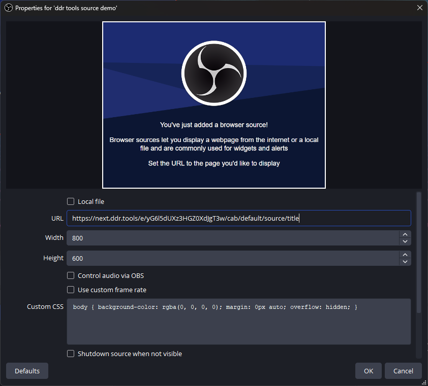

# OBS Sources

The app provides a number of single-purpose URLs for use within OBS as browser type source. Each individual cab has its own set of sources, which will update as the match assigned to that cab changes.


After clicking on one, the URL will be put on your clipboard. In OBS you can add that info to your stream layout by adding a new browser source.


Paste the copied URL into the properties and click OK.



If you have a match assigned to the chosen cab, then you should see the text appear immediately. If nothing is assigned to the cab, then the source will display nothing at all.

## Custom styles

Adding custom CSS to text-based sources is a great way to help the info fit the graphic design of the rest of your stream graphics.

All text-based sources from DDR Tools render inside a single `h1` HTML tag. Keep the existing default styles for `body` and add extra styles below. As a simple example:

```css
body {
  background-color: rgba(0, 0, 0, 0);
  margin: 0px auto;
  overflow: hidden;
}
h1 {
  color: black;
  font-size: 600%;
  text-shadow: 2px 2px 2px white;
  -webkit-text-stroke: 2px red;
}
```


For more info on styling text with CSS, refer to [MDN documentation](https://developer.mozilla.org/en-US/docs/Learn_web_development/Core/Text_styling).

Some common CSS style rules that will likely be useful for a stream layout:

- [text-align](https://developer.mozilla.org/en-US/docs/Web/CSS/text-align) ([more on this below](#text-alignment))
- [font-family](https://developer.mozilla.org/en-US/docs/Web/CSS/font-family) ([more on this below](#custom-fonts))
- [color](https://developer.mozilla.org/en-US/docs/Web/CSS/color)
- [font-size](https://developer.mozilla.org/en-US/docs/Web/CSS/font-size)
- [font-weight](https://developer.mozilla.org/en-US/docs/Web/CSS/font-weight)
- [font-style](https://developer.mozilla.org/en-US/docs/Web/CSS/font-style)
- [text-shadow](https://developer.mozilla.org/en-US/docs/Web/CSS/text-shadow)
- [-webkit-text-stroke](https://developer.mozilla.org/en-US/docs/Web/CSS/-webkit-text-stroke)

### Text alignment

In order to have text position correctly within the layout as it updates with values of varying lengths, it's important that you set the correct alignment direction! Text will align left by default, but if it should be visually centered in the layout (e.g. a title) or aligned against the right side (e.g. name of a player on the right) then the alignment should be set accordingly.

If you use no other custom styles, at least set the alignment of anything not left-aligned correctly with one of:

- `text-align: center;`
- `text-align: right;`

### Custom Fonts

The font of choice can be chosen with a `font-family` rule. By default it will have access to any font you have installed locally on your system. Additional fonts can be used without any installation steps directly from google fonts:

1. Visit [fonts.google.com](https://fonts.google.com) and find something you would like to use. (for example, [Tektur](https://fonts.google.com/specimen/Tektur?categoryFilters=Feeling:%2FExpressive%2FFuturistic))
2. Click the "Get Font" button on the font page, and then the "Get embed code" button.
3. On the web tab, switch to `@import` style.
4. Copy the contents of the `<style>` tag into the custom css in OBS, and note that @import rules must be _AT THE VERY TOP_.
5. Add a `font-family` rule to the `h1` style block selecting the custom font.

A final example in action:

```css
@import url("https://fonts.googleapis.com/css2?family=Tektur:wght@400..900&display=swap");
body {
  background-color: rgba(0, 0, 0, 0);
  margin: 0px auto;
  overflow: hidden;
}
h1 {
  font-family: "Tektur";
  font-size: 600%;
}
```


