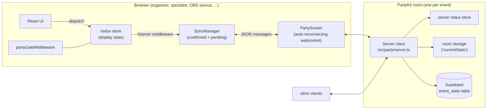
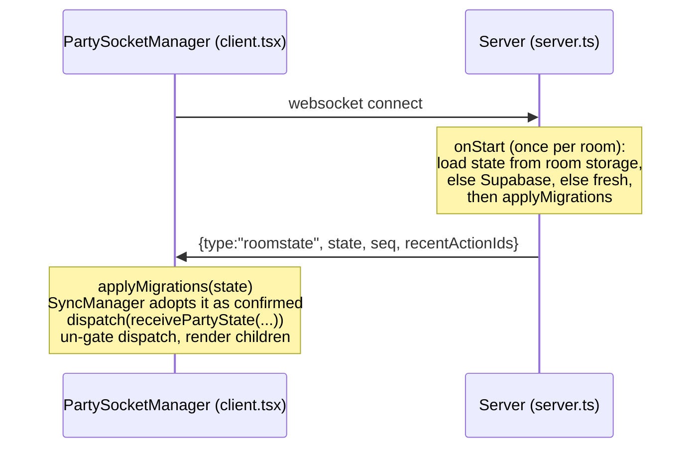
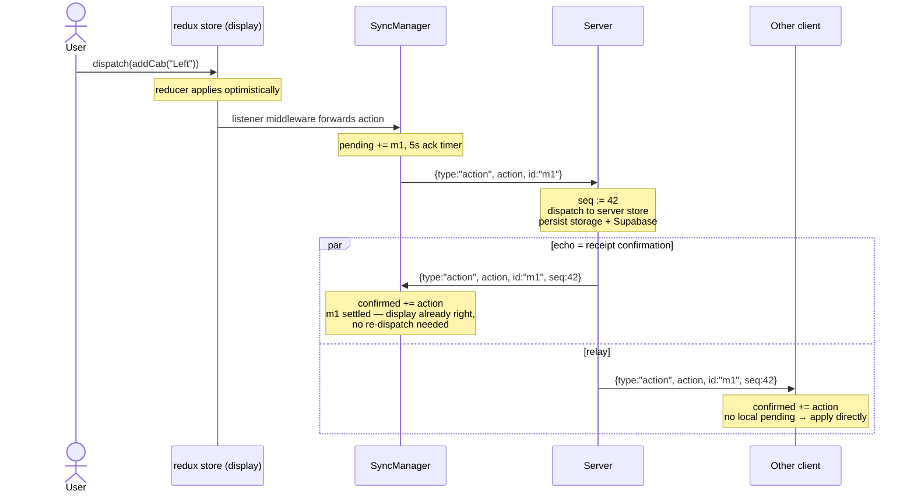
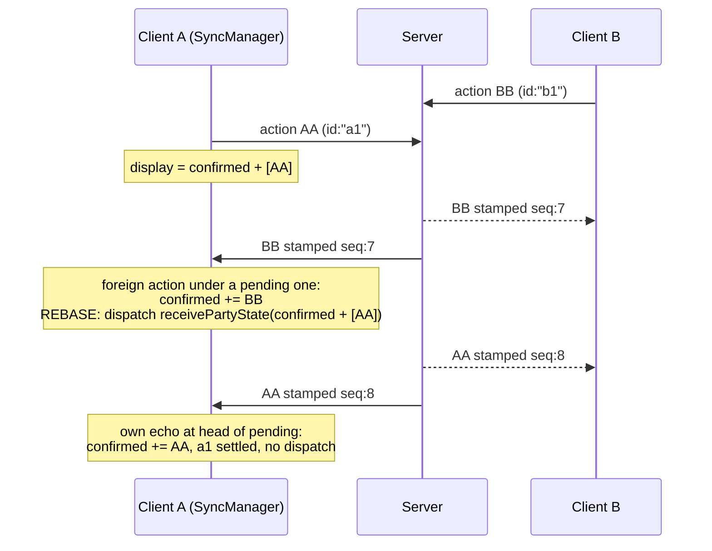
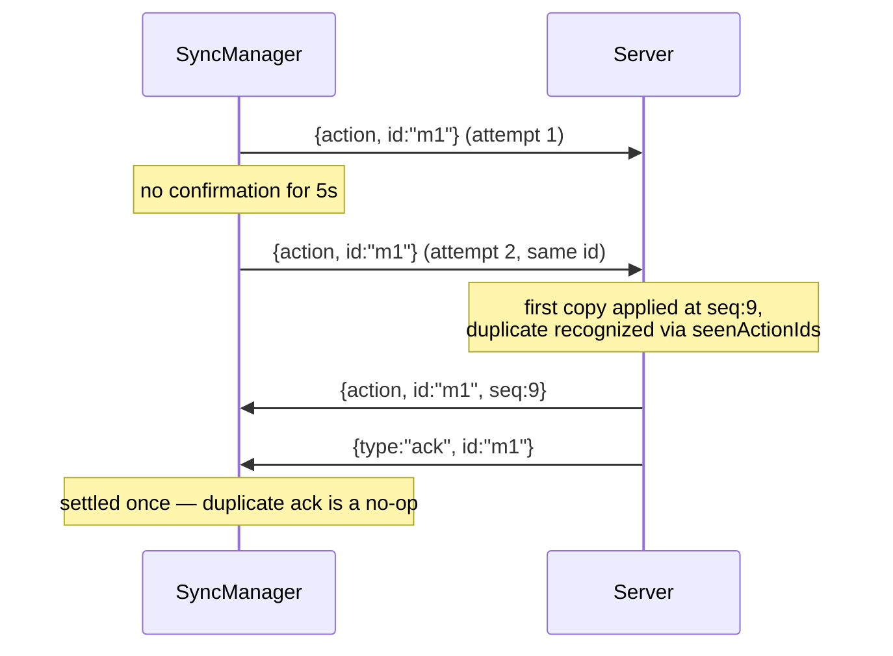
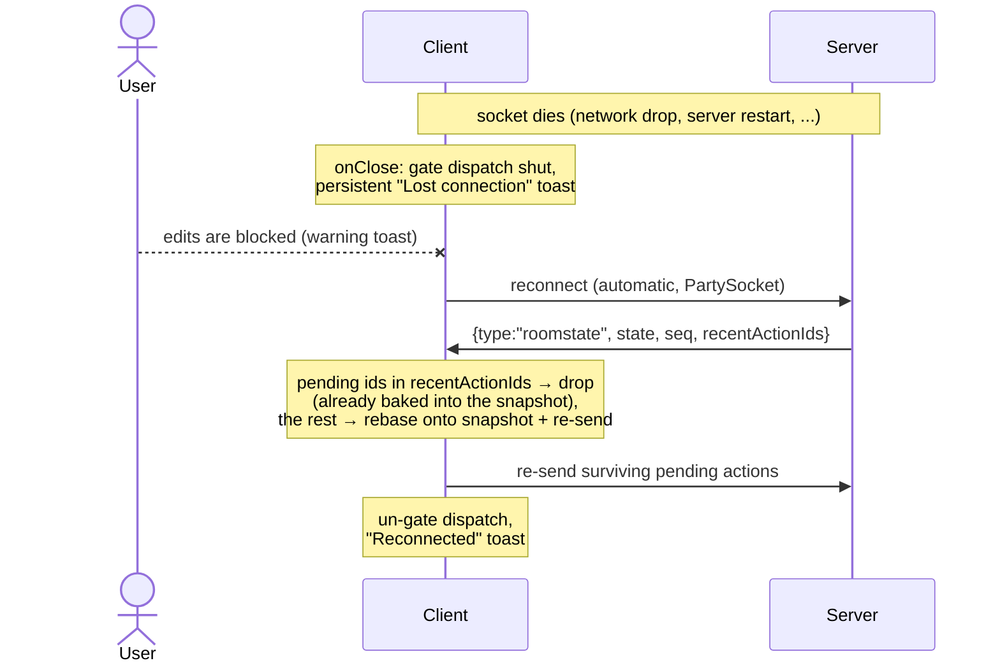

# Event-mode sync: how it works

A developer's tour of the backend and state-sync design behind event mode
(`/e/:roomName`). This describes what exists today and where each piece
lives in the source. For where the design is headed next, see
[partykit-sync-roadmap.md](./partykit-sync-roadmap.md).

## The big picture

Every event is a [PartyKit](https://docs.partykit.io/) **room**: a single
server-side actor that owns the authoritative copy of that event's state and
relays updates between everyone viewing it. Both the browser and the room run
the **same redux reducer bundle** (`src/state/root-reducer.ts`), so state is
synchronized by shipping _redux actions_ over a websocket rather than
diffing state objects. The server orders those actions and every replica
applies them in the same order — a replicated state machine with a central
sequencer.

Key source files:

| Concern                                               | File                                 |
| ----------------------------------------------------- | ------------------------------------ |
| Room server (message handling, ordering, persistence) | `src/party/server.ts`                |
| Wire protocol message types                           | `src/party/types.ts`                 |
| React socket manager (connect UI, toasts, wiring)     | `src/party/client.tsx`               |
| Client replication logic (confirmed/pending, retries) | `src/party/sync-manager.ts`          |
| Dispatch gate while disconnected                      | `src/state/party-gate-middleware.ts` |
| Connection-health flag shared with middleware         | `src/party/connection-status.ts`     |
| Shared reducer + wholesale state replacement          | `src/state/root-reducer.ts`          |
| Host/endpoint resolution, HTTP state fetch            | `src/party/host.ts`                  |
| Store construction and middleware order               | `src/state/store.ts`                 |

`PartySocketManager` (`src/party/client.tsx`) is mounted by the shells that
need a live room: the tournament UI (`src/tournament-mode/index.tsx`) and OBS
browser sources (`ObsSource` in `src/app.tsx`). Preview mode
(`src/preview-mode/shell.tsx`) is read-only and instead fetches a one-shot
state snapshot over HTTP (`getPartykitState` in `src/party/host.ts`, served
by `onRequest` in `src/party/server.ts`). Classic mode uses the same store
factory but never connects a socket.

## Wire protocol

All messages are JSON. The types live in `src/party/types.ts`.

| Message                                           | Direction                | Meaning                                                                                                                                                                              |
| ------------------------------------------------- | ------------------------ | ------------------------------------------------------------------------------------------------------------------------------------------------------------------------------------ |
| `{type:"action", action, id}`                     | client → server          | "Please apply this redux action." `id` is a unique message id (nanoid) used for receipt confirmation and dedupe.                                                                     |
| `{type:"action", action, id, seq}`                | server → **all** clients | The same action, stamped with its canonical position. The copy sent back to the sender doubles as the receipt confirmation.                                                          |
| `{type:"roomstate", state, seq, recentActionIds}` | server → one client      | Full state snapshot, sent on every (re)connect. `seq` is the last action baked into `state`; `recentActionIds` lets a reconnecting client drop pending re-sends that already landed. |
| `{type:"ack", id}`                                | server → sender          | Sent instead of a re-apply when a duplicate re-send arrives for an already-applied `id`.                                                                                             |

`id` and `seq` are optional on the wire for compatibility with older
deployments; see "Version interop" at the end.

## The client state model

The heart of the client is one invariant, maintained by `SyncManager`
(`src/party/sync-manager.ts`):

> **display state == confirmed state + pending actions, replayed in order**

- **Confirmed state** is built _only_ from server-stamped actions applied in
  `seq` order. It converges identically on every replica. It lives as a
  plain object inside `SyncManager` — not in the redux store.
- **Pending actions** are the user's own dispatches that the server hasn't
  confirmed yet. They're already applied to the display store (optimistic
  UI) and are re-sent until confirmed.
- **Display state** is what the redux store holds and the UI renders.

Most of the time the invariant maintains itself with no extra work (your own
echo just moves the boundary between confirmed and pending). When it can't —
a foreign action gets ordered underneath your unconfirmed one, a reconnect
brings a fresh snapshot, or a pending action is abandoned — `SyncManager`
recomputes `confirmed + pending` with the shared reducer and swaps it into
the store wholesale. That swap is the `receivePartyState` action
(`src/state/central.ts`), which the root reducer treats as full state
replacement (`src/state/root-reducer.ts`).

How a local dispatch reaches the wire: the redux listener middleware
(`src/state/listener-middleware.ts`, registered in `src/party/client.tsx`)
forwards every locally-originated action to `SyncManager.send()`. Actions
that arrived _from_ the network are marked `meta.source: "partykit"` and
skipped by the listener's predicate, so nothing echoes back out.

## Message flows

### Connecting

Until the first roomstate arrives, the UI shows a "Connecting..." card and
the app's children aren't rendered at all (`ready` state in
`src/party/client.tsx`).

### The happy path: one client edits, everyone converges

Server-side, `onMessage` in `src/party/server.ts` does the stamping,
broadcasts to **everyone including the sender**, applies the action to its
own store, writes the new state to room storage (`currentState` key), and
upserts it to Supabase's `event_state` table when credentials are configured.

### Concurrent edits: the rebase

This is why confirmed/pending exists. Suppose client A dispatches `AA` while
client B's `BB` is in flight, and the server orders `BB` first:

Both clients end at `confirmed = ...BB, AA` — identical state in canonical
order, even though A briefly displayed `AA` without `BB`. Without the
sequencer each replica would have kept its own arrival order forever.

This only works because reducers are **deterministic**: replaying the same
action must produce the same state on every replica. Ids and timestamps must
be minted in `prepare` callbacks or thunks so they ride inside the action
payload (see `addCab` in `src/state/event.slice.ts` for the pattern), never
inside reducers.

### Loss, retry, and giving up

Sends are tracked until the stamped echo (or an `ack`) settles them
(`transmit`/`handleAckTimeout` in `src/party/sync-manager.ts`):

- The server remembers the last 1000 applied ids (`seenActionIds` in
  `src/party/server.ts`) so a re-send is **never applied twice** — it just
  gets re-confirmed.
- After 4 unconfirmed attempts on a live connection, the client gives up:
  the action is dropped from pending, the display state is rebased _without
  it_ (rolling the phantom change back out of the UI), and a danger toast
  explains that the change could not be delivered.

### Disconnect and reconnect

Two details worth knowing:

- **Dispatch stays gated until the roomstate is fully applied**, not merely
  until the socket reopens. This closes a race where an action dispatched in
  the open-but-not-yet-synced window would be silently erased by the
  arriving snapshot. The gate is `partyGateMiddleware`
  (`src/state/party-gate-middleware.ts`), which consults a module-level
  health flag (`src/party/connection-status.ts`) that deliberately lives
  _outside_ the synced `AppState` — connection health must never replicate
  to other clients or persist to the server.
- Actions that went unconfirmed _before_ the drop survive it: they're held
  in pending and replayed after the snapshot. `recentActionIds` exists so an
  action that actually landed just before the disconnect isn't applied a
  second time.

If a client ever observes a **gap in `seq`** (a missed broadcast on a live
socket), it can't trust its confirmed state anymore; the repair is to force
a reconnect and take a fresh roomstate (`resync` handler wired to
`socket.reconnect()` in `src/party/client.tsx`).

## User-facing connection health

All the toasts live in `src/party/client.tsx` (strings in
`src/assets/i18n.json` under `party.*`, en + ja):

| Moment                                | UI                                        |
| ------------------------------------- | ----------------------------------------- |
| Socket closed after a successful sync | persistent danger toast; edits blocked    |
| Edit attempted while blocked          | warning toast, action dropped by the gate |
| Roomstate applied after reconnect     | success toast, edits re-enabled           |
| Action abandoned after repeated sends | danger toast + local rollback             |

Toasts render through the app-root `OverlayToaster` (`src/toaster.tsx`) and
are suppressed when running inside an OBS browser source (`useInObs` from
`src/theme-toggle.tsx`) — an overlay on stream should never show connection
chrome.

## Server persistence

`src/party/server.ts` keeps three copies of truth in sync:

1. **In-memory redux store** — authoritative while the room actor is alive.
   Hydrated in `onStart` from room storage, falling back to Supabase, with
   `applyMigrations` (`src/state/migrations.ts`) run over whatever loads.
2. **PartyKit room storage** — `currentState` key, rewritten after every
   applied action. Survives room hibernation/restarts.
3. **Supabase** (`event_state` table, typed in
   `src/party/database.types.ts`) — best-effort upsert after every action;
   disabled unless `SUPABASE_URL`/`SUPABASE_KEY` are present. Serves as
   cross-deployment durability.

The room also answers plain HTTP `GET` with its current state JSON
(`onRequest`), which preview mode and debugging tools use via
`partykitEndpoint`/`getPartykitState` in `src/party/host.ts`. In development
the client targets `localhost:1999` (`yarn start:backend`); in production,
the deployed PartyKit host — both resolved in `src/party/host.ts`.

## Version interop

The protocol fields are optional so mixed deployments degrade instead of
corrupting state:

- Actions **without `id`** (pre-protocol clients) are relayed the old way —
  broadcast excluding the sender, unstamped — because such clients can't
  recognize their own echo and would double-apply it.
- A roomstate **without `seq`** (older server) drops the client back to
  plain optimistic apply: pending tracking still works via `ack`s, but no
  rebasing and no give-up rollback (guarded by `lastSeq == null` in
  `src/party/sync-manager.ts`).
- Deploy order when the protocol grows: **server first, web app second.**

## Poking at it locally

Run `yarn start:backend` (PartyKit on `:1999`) and `yarn start:frontend`
(webpack on `:8080`), then open `/e/any-room-name` in two tabs and watch the
websocket frames in devtools. `.claude/skills/verify/SKILL.md` documents a
scripted version of this, including how to freeze the server mid-flight
(SIGSTOP the `workerd` process) to exercise the retry, rebase, and
reconnect paths.
