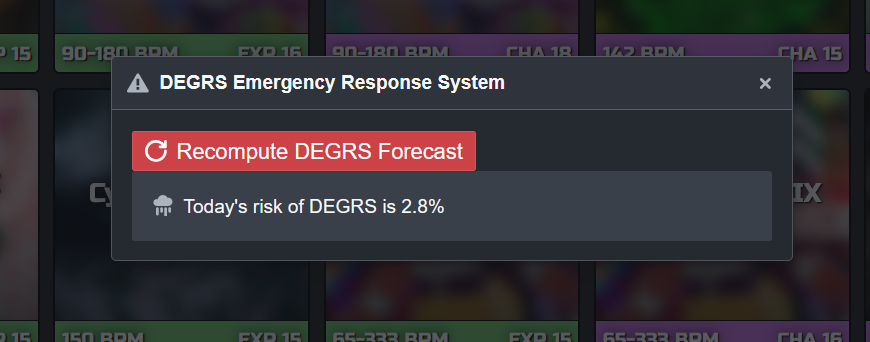

# Probabilities in Card Draw

Here is a handful of common questions asked about chances of certain things happening with this app, and the ways you calculate the answers.

First, we must establish the "X choose N" or combination function, often denoted as _<big><sub>x</sub>C<sub>n</sub></big>_. The two inputs are:

- _x_, the total number of things to choose from
- _n_, the number of them being chosen

The combinations function calculates the number of different combinations that are possible in a given scenario. The result is calculated as:

```
x * (x - 1) * (x - 2) * ... (x - n)
-----------------------------------
   n * (n - 1) * (n - 2) * ... 1
```

For example:

## How many different sets of 5 cards can be drawn?

This one is simple. Just count up how many charts are eligible to be chosen given your settings. For the sake of example, let's assume that 300 charts are in the pool of options (the deck of cards, so to speak).

We only have to then calculate _<big><sub>300</sub>C<sub>5</sub></big>_ or "300 choose 5".

This gives us `x = 300` and `n = 5`, so calculating the result is rather simple:

```
300 * 299 * 298 * 297 * 296
--------------------------- = 19.6 billion!
     5 * 4 * 3 * 2 * 1
```

That's a lot of possible draws!

## What are the chances of drawing a lvl 18 chart?

Now we're calculating a probability, which is going to be answered as a fraction (aka percentage). The numerator is the number of possible outcomes that meet your criteria, and the denominator is the number all possible outcomes both meeting and not meeting the specific criteria.

We've already calculated the denominator in the previous question, so we can focus on the first part. First, we need to know how many 18s are in the pool (easily checked using "show eligible charts"). Let's assume that we have 10 level 18 charts in the pool for now. Given that, we need to total up all the scenarios that might match our criteria of interest:

- The number of 5 card draw combinations that have _all 18s_ would be expressed as _<big><sub>10</sub>C<sub>5</sub></big>_
- The number of 5 card draw combinations that have _exactly 4 18s_ would be expressed as _<big><sub>10</sub>C<sub>4</sub> \* <sub>290</sub>C<sub>1</sub></big>_
- The number of 5 card draw combinations that have _exactly 3 18s_ would be expressed as _<big><sub>10</sub>C<sub>3</sub> \* <sub>290</sub>C<sub>2</sub></big>_
- The number of 5 card draw combinations that have _exactly 2 18s_ would be expressed as _<big><sub>10</sub>C<sub>2</sub> \* <sub>290</sub>C<sub>3</sub></big>_
- The number of 5 card draw combinations that have _exactly 1 18_ would be expressed as _<big><sub>10</sub>C<sub>1</sub> \* <sub>290</sub>C<sub>4</sub></big>_

Now we can calculate each and sum them all up for the total number of draw possibilities with _at least one lvl 18 chart_: 3 billion!

Finally, the chances of drawing any level 18 chart are `3 / 19.6`, or 15.3%!

## What are the chances of drawing DEGRS?

Under ordinary (un-weighted) circumstances this is actually a pretty small chance. Let's assume that DEGRS is one of our 300 possible charts from before. The number of ways it can show up in a 5 card draw is simply the number of combinations of other cards that show up next to it, or _<big><sub>299</sub>C<sub>4</sub></big> = 326 million_. Dividing by 19.6 billion gives the final percentage at a 1.7% chance of appearing in any single draw.

However, when weighted distributions are involved, things change. A LOT...

# The dirty details of Weights

The app's weighted distribution option allows wild changes to be applied to the probabilities of various outcomes, but it also comes with another setting enabled by default: _Force Expected Distribution_

That setting's behavior will force us to approach the math a little differently. First, let's assume the following weight distribution setup.

|    Level |  14 |  15 |  16 |  17 |  18 |
| -------: | --: | --: | --: | --: | --: |
| Weighted | 10% | 25% | 30% | 25% | 10% |

Let's also assume that the default _Force Expected Distribution_ option is also left enabled. This means there are hard limits on how many of a single difficulty level may appear, _regardless of the underlying probabilites_. The above configuration will result in the following constraints when used with a 5 card draw count:

|          Level |  14 |  15 |  16 |  17 |  18 |
| -------------: | --: | --: | --: | --: | --: |
| Total drawable | 0-1 | 1-2 | 1-2 | 1-2 | 0-1 |

Phrased another way: Each drawn set will contain at least one chart each of level 15, 16, and 17. The remaining two charts could be anything 14-18, but not two of either 14s or 18s.

At this point the probabilities get so complicated that it's easier to take a different approach: sampling. Instead of meticulously counting out every possible outcome with these complex constraints, we can simply draw thousands of sets, count up the results, and calculate an answer from that. As long as we have a large enough sample size the results should be reliable.

## The DEGRS Forecast

A secret feature exists in the card draw specificallly to perform 10,000 card draws and check each one for the presence of DEGRS. I'll let the process of finding it be an exercise for the reader, but I can say with confidence that common tournament card draw settings can artificially inflate the risk of DEGRS to 3% or beyond!



# Conclusion

Using the weighted distribution options can skew the probabilities in surprising and undesirable ways. Additionally, it can be fairly difficult to definitively calculate the chances of any specific outcome when they are involved. Fundamentally they remove elements of randomness from the draw outcomes, but that lack of randomness can also be a drawback.
